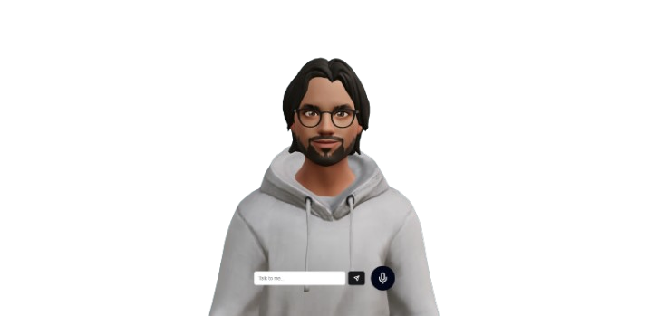
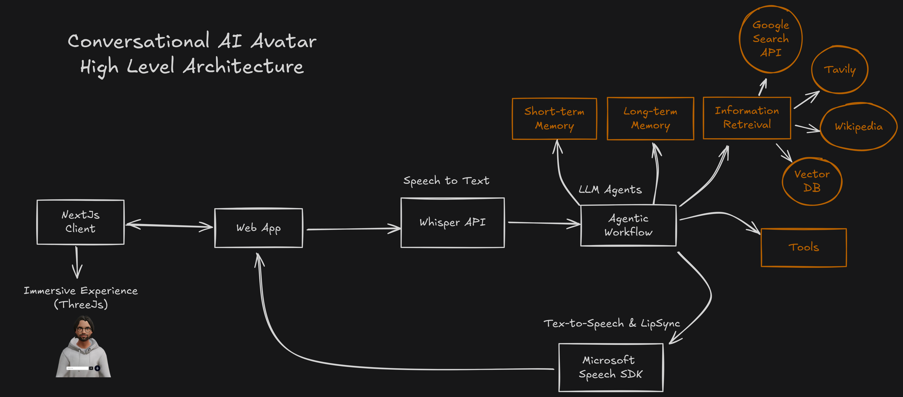
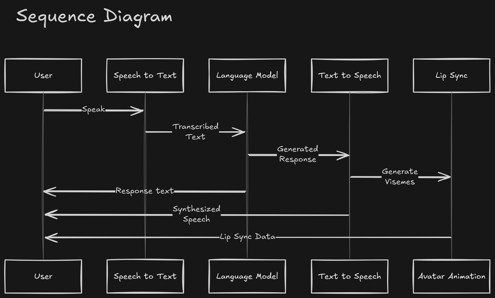

<div align="center">
  <a href="https://github.com/othneildrew/Best-README-Template">
    
  </a>

  <h3 align="center">Conversational AI Avatar</h3>

  <p align="center">
    An prototype to demonstrate the workflow of an end-to-end ai avatar, using speech-to-text, text-to-speech and an agentic workflow.
  </p>
Demo Video:

</div>


<!-- TABLE OF CONTENTS -->
<details>
  <summary>Table of Contents</summary>
  <ol>
    <li>
      <a href="#about-the-project">About The Project</a>
      <ul>
        <li><a href="#key-features">Key Features</a></li>
        <li><a href="#objectives">Objectives</a></li>
        <li><a href="#high-level-architecture">High Level Architecture</a></li>
        <li><a href="#built-with">Built With</a></li>
      </ul>
    </li>
    <li>
      <a href="#getting-started">Getting Started</a>
    </li>
    <li><a href="#known-issues">Known Issues</a></li>
    <li><a href="#roadmap">Roadmap</a></li>
  </ol>
</details>

<!-- ABOUT THE PROJECT -->
## About The Project

This project is a prototype designed to demonstrate the workflow of an end-to-end
AI avatar. This project integrates various technologies to enable speech-to-text,
text-to-speech, and an agentic workflow to create a seamless conversational experience.

### Key Features
- Conversation through **speech or text**
- **3D avatar** for a more engaging user interaction
- Avatar **lip-sync** for more immersive conversational responses

### Objectives
- To explore the integration of different AI technologies that together enable a seamless conversational experience.
- To create a user-friendly and interactive AI avatar.
- To demonstrate the potential applications of conversational AI in various domains such as learning platforms.

### High Level architecture

<p align="center">
  
</p>

The high-level architecture of the Conversational AI Avatar consists of the following components:

1. **Speech-to-Text (STT) Module**: Converts spoken language into text. Currently it is using the OpenAI Whisper API, but as the model is open source, we could also be running it locally

2. **LLM Agents**: This module is crucial for maintaining a coherent and contextually relevant conversations with the AI avatar. The module is using Langchain and Langgraph for the agentic workflow and OpenAI LLM models.\
Note: The components highlighted in orange are currently not implemented due to the rapid prototyping phase. However, they are crucial for enhancing conversation flows and actions, and provide a more immersive experience.

3. **Text-to-Speech (TTS) and Lip Sync Module**: This module addresses both speech synthesis and lip synchronization. In this high level architecture both are merged because we are using Microsoft Cognitive Services Specch SDK, which already gives us the speech synthesis and visemes with timestamps for the lip sync. In the future we could try other advanced methods for TTS, such as Eleven Labs API. However, visemes prediction is a challenging problem with limited solutions. We could look for open source alternatives or create a custom solution.

4. **3D Avatar Module**: A visual representation of the AI enhances the immersive experience. This prototype use a *Ready Player Me* avatar, which can be exported with armature and morph targets to create an expressive and interactive avatar. The avatar is rendered using Three.js, a WebGL library.

The flow of the application is the following:

<p align="center">
  
</p>

### Built With

* [![LangChain][LangChain]][LangChain-url]
* [![LangGraph][LangGraph]][LangGraph-url]
* [![OpenAI][OpenAI]][OpenAI-url]
* [![Next][Next.js]][Next-url]


## Getting Started

You need API keys for 2 different Services: OpenAI and Azure

Refer to the following links to learn how to create the keys:
- https://platform.openai.com/docs/quickstart
- https://azure.microsoft.com/en-us/free

Copy the `.env.example` to create a `.env.local` at the root of the repository and add the OpenAI and Azure Keys

First, install the dependencies
```bash
npm install
# or
yarn
```

Then, run the development server:

```bash
npm run dev
# or
yarn dev
```

Open [http://localhost:3000](http://localhost:3000) with your browser to see the webapp.

You can start editing the page by modifying `app/page.tsx`. The page auto-updates as you edit the file.

## Known Issues

* Sometimes, the LLM gives a response with values that aren’t accepted in the HTTP headers. The current workflow of sending result values on the headers along with the audio stream must be changed to send a content type of "*multipart/mix*" and avoid this issue
* React three fiber hasn't updated its dependency to React 19, so there may be some errors when installing the npm packages

## Roadmap

- [ ] Expand with short term and long term memory. Conversation summarization and user-based memory should work great.
- [ ] Test a reasoning model like deepseek to stream the thinking of the avatar and get better responses in general
- [ ] Implement a more agentic workflow, understand the need of the user like search, retreive information, task saving, etc.
- [ ] Add tool calling for actions inside the immersive experience, maybe move the avatar around a room, across rooms, write something on a blackboard, point at a place, etc
- [ ] Make the avatar more emotional. Using agentic workflows we can add an agent that break the conversation into parts and classify the emotion for each part. Then we can update the face emotions via morph targets based on the classifications
- [ ] Test speech to text using elevenlabs and getting visemes with an open source solution

<!-- MARKDOWN LINKS & IMAGES -->
<!-- https://www.markdownguide.org/basic-syntax/#reference-style-links -->
[Next.js]: https://img.shields.io/badge/next.js-000000?style=for-the-badge&logo=nextdotjs&logoColor=white
[Next-url]: https://nextjs.org/
[LangChain]: https://img.shields.io/badge/langchain-1C3C3C?style=for-the-badge&logo=langchain&logoColor=white
[LangChain-url]: https://www.langchain.com/
[LangGraph]: https://img.shields.io/badge/langgraph-1C3C3C?style=for-the-badge&logo=langgraph&logoColor=white
[LangGraph-url]: https://www.langchain.com/
[OpenAI]: https://img.shields.io/badge/openai-412991?style=for-the-badge&logo=openai&logoColor=white
[OpenAI-url]: https://platform.openai.com/